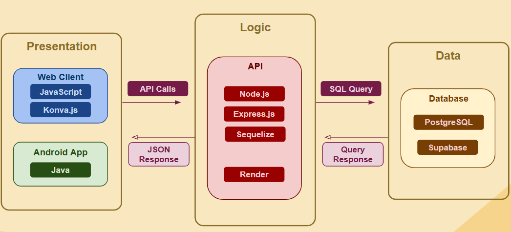

# Vision Statemnt

Ever been too lazy to call for a reservation? How about being seated right by the washroom? Has managing the restaurant been too chaotic to pick up a call? At TableTrack, we can change that. TableTrack is your all-in-one service to discover restaurants, read reviews, and make your own personalized reservations. When you make a reservation with TableTrack, you choose the table you deserve. TableTrack allows users to choose the table with the seating they prefer, whether that be in a chair, on a stool or in a booth, as well as the location they desire, that being near the entrance, by the window or even by the washroom.

TableTrack is designed to make dining out more personal and convenient, bridging the gap in traditional reservation systems by giving diners the ability to not just book a table, but to actually choose the exact spot they want to sit in. Our target audience are customers who enjoy customizing their dining experience and managers who want to manage their restaurants in a more efficient manner, all through one application. With TableTrack, people can book a table without having to call the restaurant, check in real time if the restaurant is full, and even reserve premium tables at an extra cost for those special occasions. It’s about putting control in the hands of the customer, creating a smoother experience for both diners and restaurants, and making dining out feel simple, stress-free, and tailored to personal preferences.

# [Project Proposal Presentation](./proposal_presentation.pdf)

# Core Features and User Stories

## Account Creation and Management

* As a user, I want to be able to edit my account details, so that I can keep my info up to date.  
  * As a manager, I want to reset my password so that I can regain access to my restaurant account if I forget it.  
  * As a customer, I want to update my profile information so that restaurants have my most current contact details.  
* Manager  
  * As a manager I want to be able to create an account so that I can create and edit my restaurant's dashboard/profile.  
    * As a manager, I want to upload a logo and restaurant details so that customers can easily recognize my business.  
* Customer  
  * As a customer I want to be able to create an account so that I can make, save, edit and cancel any reservations under my name.  
  * As a customer, I want to delete my account so that my data is no longer stored in the system.  
  * As a customer, I want to receive a confirmation email when I register so that I know my account was created successfully.

## Book Reservation

* As a customer I want to be able to see what spots are available at the restaurant, so that I can make a reservation.  
* As a customer, I want to be able to reserve a certain amount of seats so I can ensure I have enough for the people I will eat with.  
* As a customer, I want to filter available reservations by date and time so that I can quickly find a slot that works for me.  
* As a customer, I want to add special requests (e.g., high chair, merge table for bigger groups) during reservation so that the restaurant can accommodate them.  
* As a customer, I want to be able to add a note to my reservation for special requests (ex: move two tables together).  
* As a customer, I want to choose my preferred seating area (e.g., patio, window, booth) during reservation so that I enjoy my visit more.

## See Reservations

* As a customer, I want to modify an existing reservation so that I can change my booking details without cancelling.  
* As a customer, I want to see the current reservations at a restaurant so I can see if the restaurant is already full.  
* As a customer, I want to see the floor plan so that I can plan the seating for my group.  
* As a manager, I need to be able to cancel a customer’s reservation, and contact the customer afterwards.  
* As a manager, I want to be able to see what spots were reserved, so I can prepare the restaurant accordingly.

## Restaurant List / Detail

* As a client, I want to search for restaurants by location or cuisine tag, so that I can discover the right branch to visit.  
* As a customer, I want to be able to view multiple restaurants at once so that I can decide where to eat.  
* As a customer, I want to compare availability across multiple restaurants so that I can choose the most convenient option.

# Non-Functional Feature

* The database will purge reservations that have expired.

# Additional Features and User Stories

## Menu

* As a customer, I want to check the menu on their restaurant page, so that I know what my options are.  
* As a manager, I want to be able to curate a menu for my restaurant, so that the menu properly reflects what is provided at our restaurant.  
* As a manager, I want to organize the menu into categories (e.g., appetizers, mains, desserts, drinks), so that customers can browse easily.  
* As a manager, I want to be able to add tags/warnings for specific items so that our customers know what to be aware of in their food.  
* As a manager, I want to be able to add descriptions to items in our menu so that customers are enticed to buy them.  
  * As a customer, I want to view menu items with allergen labels so that I can avoid ingredients I can’t eat.  
* As a manager, I want to upload daily specials so that customers can see new items each day.

## Review

* As a customer, I want to check the reviews of a restaurant so that I have an impression of what the restaurant will be like.  
* As a customer. I want to be able to leave a review so I can let other people know if the restaurant has good food or to keep away from it.  
* As a customer, I want to see a list of my own reviews so I can remember what my experience was like at restaurants I have visited.  
* As a user, I want to filter through reviews of a restaurant so that I can see what went well or poorly at the restaurant.  
* As a customer, I want to add photos with my review so that others can see the food or ambiance.  
* As a manager, I want to reply to reviews so that I can thank customers or address issues.  
* As a customer, I want to rate my experience using a 1–5 star system so that others can quickly gauge satisfaction levels.

## Floor Plan Creation

* As a manager, I want to create a digital floor plan for my restaurant, so that I can map tables and seating for reservations.  
* As a manager, I want to edit the digital floor plan of the restaurant so that when tables and seating is changed, it is properly reflected in the system.  
* As a manager, I want to design a digital seating layout so that I can optimize table arrangements for reservations.  
* As a manager, I want to adjust floor plans for special events so that I can accommodate larger groups or different setups.  
* As a manager, I want to create additional floor plan layouts for special events, so that customers can pick the arrangement that meets their needs.

## Planned implementation for Sprint1
**[Features](https://github.com/BradyS0/TableTrack/issues?q=milestone%3A%22Sprint%201%22%20label%3Afeature)**

**[User Stories](https://github.com/BradyS0/TableTrack/issues?q=milestone%3A%22Sprint%201%22%20label%3Auser-story)** *(includes Acceptance cirteria)*

# Architecture Diagram

# Technology Rationale

## Presentation Layer

**Web Client:** Our primary interface will use vanilla **HTML/CSS/JS** for both management and customer views. This approach keeps the project lightweight, framework-independent, and aligns with our team’s experience. We will use **Konva.js** to streamline drawing shapes and enable drag-and-drop operations, essential for building the floor plan editor where managers can place reservable tables.

**Android App:** Our secondary frontend will be built in **Android Studio (Java)** to satisfy the requirement for a second technology. This app will focus on customers, allowing them to browse restaurant info, leave reviews, and make reservations. It will consume the same backend APIs as the web client, demonstrating clear separation between frontend and backend.

## Logic Layer

We chose **Node.js** for backend logic and **Express.js** to build REST API endpoints. We plan to leverage Node.js event-driven non-blocking model to manage concurrency. Since data will be exchanged as JSON between layers, using a JavaScript-based backend ensures consistency across layers. We will host the backend on **Render**, a PaaS that supports Node.js natively and integrates well with PostgreSQL through Sequelize, which is a Javascript ORM library for making database querying simpler and cleaner.

## Data Layer

Our database will use **PostgreSQL**, hosted on **Supabase**. Supabase provides seamless integration with PostgreSQL. PostgreSQL’s support for JSON fields makes it ideal for storing flexible data such as floor layouts and table placements, but has that foundation in relational data that we wanted for users, restaurants, etc.

# Work Division and Coordination

Our team will coordinate development by breaking down user stories into smaller tasks during group meetings held before or at the start of each sprint, with these tasks being delegated based on members expertise, interest and workload. Each member will also be responsible for writing tests for the features they implement. Features, user stories, and tasks will be organized into three sprints using GitHub’s project tools. All code will undergo review by at least one other team member before being merged, with the merger responsible for resolving any conflicts. Each user story will include a minimum of two acceptance criteria to ensure clarity and testability. We have not yet finalized our approach to automation but plan to research and integrate it into our workflow.
