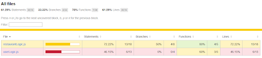
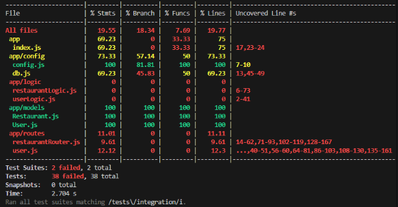
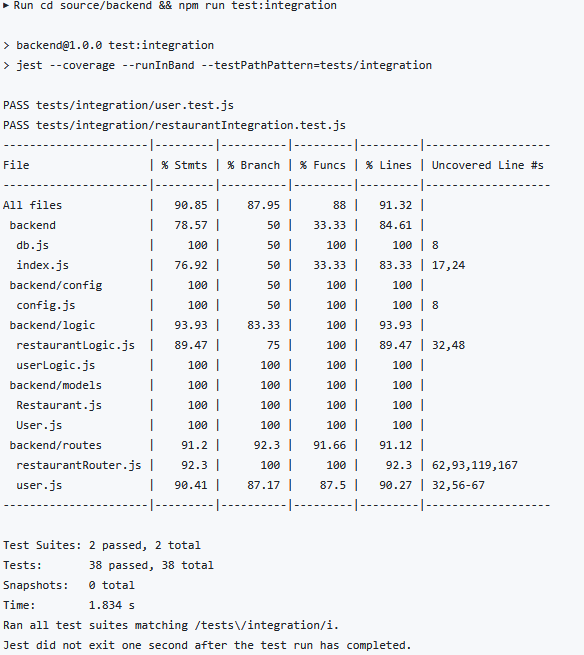

# Group 5 Testing Plan

## Testing Goals and Scope  
Explain *what parts of the system* will be tested (backend, frontend, API, etc.) and *why*—clarify the purpose and extent of your testing.

In sprint 1 our scope included:
- Account Creation and Management (Logic and Data)
- Restaurant List/Detail (Frontend requesting Data)

In future sprints we will include:
- Menus
- Reviews
- Booking Reservations
- Viewing and Editing Reservations
- Creating a Restaurant Floor Plan

Account creation and management includes most of our current logic and data layers. This is reflected by the majority of unit tests covering validation of user and restaurant parameters, and integration tests testing connections between the API, logic, and database related to the feature.

Currently the front end requires manual testing, as we encountered an issue with integration tests which must be resolved before creating automatic full system tests.

---

## Testing Frameworks and Tools  
List the frameworks (e.g., Jest, Pytest, Cypress) and tools used for running tests, measuring coverage, or mocking data, and explain *why they were chosen*.

Jest
- Run unit and integration tests
- Measure coverage

- Jest was chosen as it is a popular testing framework. Jest can also perform run tests for the frontend and backend. Since we only did tests for our backend in sprint 1, but will need to do front end testing, we thought using it would make us faster at implementing front end testing since we have been using the framework.

Supertester
- API library for testing for HTTP calls on our API’s endpoints during integration testing

- We chose Supertester because it offers a clean and simple way of making HTTP calls to our endpoints for testing purposes without the need to start up our API server.

[Super Linter](https://github.com/super-linter/super-linter )
- Ensure compliance with standards
- Forces developers to maintain clean code (eg. unused variables )
- We chose superlinter because of its ability to lint many different languages. While we haven’t configured it completely to our need (eg. enforce group coding standards), we think this will be a great all in one solution once we set everything up. 

---

## Test Organization and Structure  
Describe how your tests are arranged in folders or files (e.g., `tests/unit`, `tests/integration`), and how naming conventions help identify test purpose.

Our tests are arranged in folders to indicate what type of testing the file does. Inside each file, each test has a description/name of what function is being tested and what input is being passed. If it is a valid case, the description of the test is what inputs are being passed and if they are valid, for unit tests they may also include how the inputs are valid. If the test is an edge case, the test describes what input may cause the edge case.

---

## Coverage Targets  
Specify measurable goals (e.g., 100% API method coverage, ≥80% logic class coverage) and link them to your grading or sprint requirements.

The minimum for our measurable goals is ≥ 90% API method coverage, ≥ 80% logic class coverage, and ≥ 90% integration class coverage for Sprint 1. This is to ensure that we are on track to what we need to achieve, but also let us know there is still a lot more work to be done. The actual goal is to reach 100% API method coverage, ≥ 80% logic class coverage, and 100% integration class coverage, as this lets us know we have a good test coverage of our files.

---

## Running Tests  
Include exact commands or scripts for running each type of test and generating coverage reports, so others can easily reproduce your results.  

Instructions on how to run our project locally, including running unit and integration tests can be found [here](https://github.com/BradyS0/TableTrack/blob/main/documentation/Run_Instructions.md), though I will also copy it into here:

### Run Instructions
In order to run locally:
- Clone repository
- Open directory in editor or terminal/powershell
- Make sure you have docker desktop open
- To build the project and run unit tests in command line type:
  - cd source
- Create a .env file in the source directory with the following:
  - DB_USER=user
  - DB_PASSWORD=password
  - DB_NAME=tabletrackdb
  - DB_PORT=5432
  - API_PORT=3000
  - NODE_ENV=development
- After creating the .env file you can now run:
  - docker compose up --build
- In another terminal/powershell window type:
  - cd source
  - docker compose exec api npm run test:integration
- To shut down the project type(in same window as test):
  - docker compose down -v
- To run unit tests in command line type (either window will work):
  - cd backend
  - npm ci
  - npm run test:unit

---

## Reporting and Results  
Explain where to find test reports (HTML, console, CI output) and how to interpret them.  
Include screenshots or links if applicable (e.g., `/coverage/index.html`).

Running the unit tests will create a coverage report in the console as well as the fancy html from jest where you can see in the logic file what is not being run. This can be found at source/backend/coverage/Icov-report/index.html after unit tests have run. Right now we don’t have a lot of logic so having code that isn’t tested causes a large decrease in tested statements, branches, functions and lines.

Right at the deadline, we ran into issues running our integration tests. When merging to our dev branch, something was changed resulting in our tests failing. This implies that the issue did not come from bad tests, but because the environment was not properly set up. Because of this, the coverage seen in our last push to main is not a proper representation of the coverage of our tests. Found below are two images. The first image shows the test coverage of our last commit to main, and below that is our test coverage for the last commit where tests did work. As is seen here, the most recent commit is much more accurate to what is really covered in our tests and integration test suites.

Last commit before 4:30pm on Oct 15th

When our tests were actually working, this was the coverage (Lines 56-67 is from when we accidentally had a duplicate of one of our functions, so it was only testing the first function)
---

## Test Data and Environment Setup  
Describe how to prepare the local environment for testing (e.g., database seeding, environment variables, Docker setup).  
Mention any special configuration files required.

### Unit Tests: 
Nothing must be set up except installing dependencies specified by package-lock.json. Then tests are run using the package.json script “jest --coverage --testPathPattern=tests/unit”. All data is entered directly into the test cases. 

### Integration Tests:
To run the integration tests locally, you must start up the api server and db with docker. The instructions to start that up and run the tests are here. In order to run them you will need to have docker desktop running. Right now we have the create user/restaurant tests populating the database using the api endpoint. This makes the next tests dependent on those first tests working, which is not good. In the next iteration, we plan to fix this by creating the users, restaurants, and any other objects in a test database, then running the tests so each test is independent of the rest.

---

## Quality Assurance and Exceptions  
Identify any untested components, justify why they’re excluded, and explain how you maintain overall quality (e.g., through manual tests or code reviews).

There are 3 functions untested in our unit tests, those functions being validate_name in restaurantLogic as well as validate_all and hash_password in userLogic. We chose not to test validate_name(),  as it has the same implementation as validate_description() and seemed redundant to test. For validate_all(), all it does is call other functions and returns a boolean that is true if all functions inside return true, otherwise returns false, it seems redundant to be tested if all the other functions inside were tested, but may be removed later on. The last function that was not tested in our unit tests was hash_password(). This was mainly because we have not yet implemented password hashing and all the function does is output the exact same string as input.

When our integration tests were functioning, the only lines untested were our catch blocks for our try catch statements, and were untested because the blocks catch internal server errors, which should not happen.

To maintain overall quality, we use linting to find mistakes such as unused variables as well as code reviews to catch any bugs and improve quality.
---

## Continuous Integration
Note if your tests run automatically in a CI pipeline (GitHub Actions, GitLab CI, etc.) and how that helps maintain consistency.
GitHub Actions - linting, unit tests, integration tests
Help contain consistency, as the testing environment remains the same and we know all our code we pull will be working.

We also used a docker container to make our local build consistent no matter what system it runs on.
