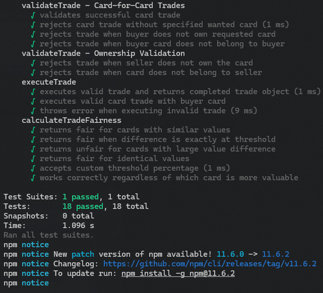

# Reproducible Environments

Our group attempted to run and build the project of group 7 “CarDex”. The project itself didn't take that long to set up and the instructions provided were clear and detailed, despite no prior experience using .NET, we were able to easily follow the instructions and build the project and run the tests. All of the tests were executed without any issues and seemed to pass.  
  
Unit and integration tests, CLI and coverage-report UI:  

Overall it took our group under 40mins to have everything setup, including having to download and install .NET. The only thing that took us long to figure out was the front-end part of the project where we were able to build and run the tests quite effortlessly.  

We sort of misunderstood and thought that “Trading Engine” had some UI element to it too and spent some time trying to start the front end, again that was a misunderstanding on our part and what was provided was just the logic part of it. Overall everything provided was of exceptional quality and all the instructions were clear and easy to follow.