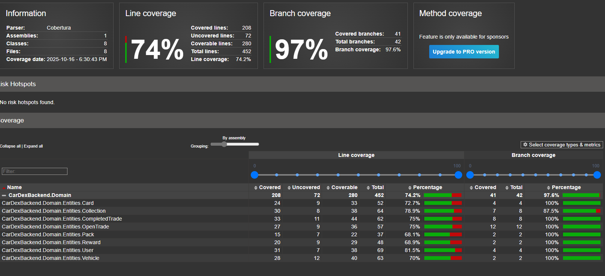

## 1. Testing Plan

https://github.com/BradyS0/TableTrack/blob/main/documentation/sprint1/TESTING_PLAN.md

## 2. Unit / Integration / Acceptance Testing
### Backend

In our backend our testing targets are as follows:

API: 100% Method coverage with > 80% Line coverage
Lower line coverage because some lines handle API responses for errors that should never occur.

Logic: > 80% Method and line coverage.
Not 100 because some logic implementations are trivial or similar enough to others to make testing redundant.

Integration: 100% Class coverage with line and method coverage same as logic.

### Frontend

There is very little to no front end logic, therefore there are no frontend logic tests.

Currently all front end testing in our project is being done manually.
Our documentation has instructions on how to carry out each test.
https://github.com/BradyS0/TableTrack/issues/51

Currently there are only frontend tests for navigating menus, and creating/editing accounts.
The main page for browsing restaurants is untested as we are still discussing future development of it such as how to handle searching, or multiple pages.

### Coverage Report

Right at the deadline, we ran into issues running our integration tests. When merging to our dev branch, something was changed resulting in our tests failing. This implies that the issue did not come from bad tests, but because the environment was not properly set up. Because of this, the coverage seen in our last push to main is not a proper representation of the coverage of our tests. Found below are two images. The first image shows the test coverage of our last commit to main, and below that is our test coverage for the last commit where tests did work. As is seen here, the most recent commit is much more accurate to what is really covered in our tests and integration test suites.

When our tests were actually working, this was the coverage (Lines 56-67 is from when we accidentally had a duplicate of one of our functions, so it was only testing the first function)

## 3. Testing Importance

Unit Tests:
**Validate password**
Test Purpose: Ensures that users create a strong password.
*Without the ability to ensure a strong password we risk allowing our users to leave themselves open to cyber attacks affecting both them and us.*
https://github.com/BradyS0/TableTrack/blob/main/source/backend/tests/unit/user.test.js Lines 90 - 127

**Validate hours**
Test Purpose: Ensure operating hours are stored in a usable format.
*It is important that customers know the hours of the restaurant they intend to eat at so they don’t show up, or try to make a reservation while they are closed.*
https://github.com/BradyS0/TableTrack/blob/main/source/backend/tests/unit/restaurantLogic.test.js Lines 86 - 117

**Validate address**
Test Purpose: Ensure the restaurant’s address has a valid format.
*Similar to Validate Hours, it is vital that restaurants have a valid address so customers aren’t sent driving in circles looking for their destination.*
https://github.com/BradyS0/TableTrack/blob/main/source/backend/tests/unit/restaurantLogic.test.js Lines 5 - 23

Integration tests:
**Creating an account (POST /v1/user/)**
Test Purpose: Ensure an API call to create a user can do so successfully.
*If potential new users of our app are unable to create the account needed to access all of our features, we will lose out on potential business.*
https://github.com/BradyS0/TableTrack/blob/main/source/backend/tests/integration/user.test.js Lines 31 - 120

**Login (POST /v1/user/login)**
Test Purpose: Ensure after making an account, a user can access it.
*Similarly to creating an account, if our existing users are unable to access their account we will lose their business, but also hurt their opinion of us.*
https://github.com/BradyS0/TableTrack/blob/main/source/backend/tests/integration/user.test.js Lines 122 - 143

**Get a list of restaurants (GET /v1/restaurant)**
Test Purpose: Ensure that restaurants are delivered upon the API call.
*One of the most important pages of our front end displays a list of restaurants, if that list cannot be delivered, users cannot browse and discover restaurants.*
https://github.com/BradyS0/TableTrack/blob/main/source/backend/tests/integration/restaurantIntegration.test.js Lines 146 - 155

Acceptance Tests:
**User Login and Navigation Menu**
Test Purpose: Ensure menu shows login option.
*The navigation menu and the option to sign in are vital to access other features of TableTrack and therefore must be working at all times.*
https://github.com/BradyS0/TableTrack/issues/51 (Manual Testing)

**User Profile Management**
Test Purpose: Ensure the user can change their information
*It is important that reservations are made under the correct name, and that restaurants have a valid email to contact customers*
https://github.com/BradyS0/TableTrack/issues/51 (Manual Testing)

**Account Creation**
Test Purpose: Ensure account creation menu works.
*Similarly to Login, users must have an account to access all features.*
https://github.com/BradyS0/TableTrack/issues/51 (Manual Testing)

## 4. Reproducible Environments

Our group attempted to run and build the project of group 7 “CarDex”. The project itself didn't take that long to set up and the instructions provided were clear and detailed, despite no prior experience using .NET, we were able to easily follow the instructions and build the project and run the tests. All of the tests were executed without any issues and seemed to pass.  
  
Unit and integration tests, CLI and coverage-report UI:  

Overall it took our group under 40mins to have everything setup, including having to download and install .NET. The only thing that took us long to figure out was the front-end part of the project where we were able to build and run the tests quite effortlessly.  

We sort of misunderstood and thought that “Trading Engine” had some UI element to it too and spent some time trying to start the front end, again that was a misunderstanding on our part and what was provided was just the logic part of it. Overall everything provided was of exceptional quality and all the instructions were clear and easy to follow.

