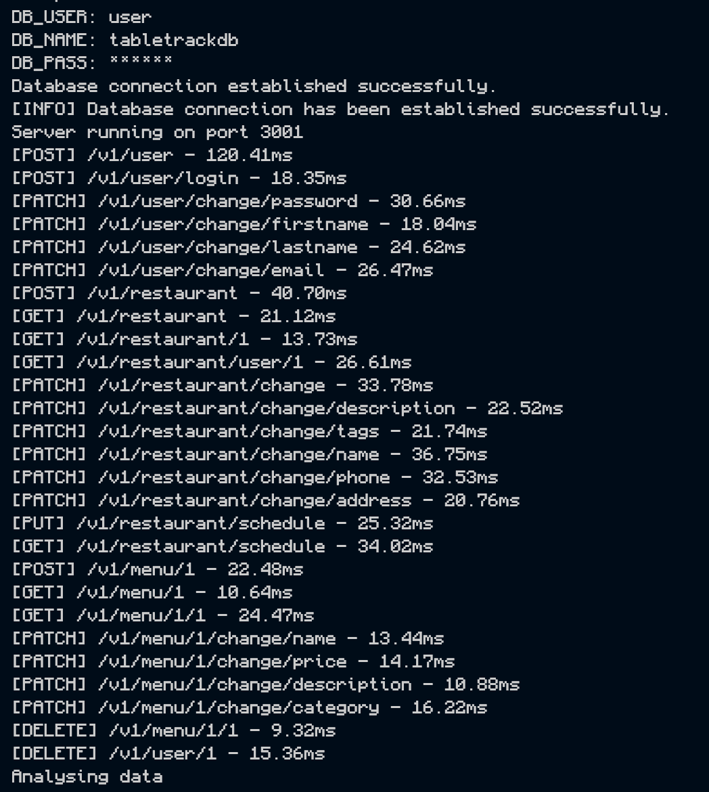

# Profiler Explanation

## Slowest Endpoint

Below is an image of all of our endpoint repsonse times. It's important to note that the API server and database are running locally with docker, so the response time depends heavily on local machine speed. We tested it out on a faster machine and the slowest endpoint [POST] /v1/user, was down to 40 ms and the others were reduced by the same scale.

As you can see, the endpoint that takes the longest is creating a user. After discussing, we realized it was making findAll call to the database where the rest of our endpoints use findOne. In these cases if we find one or more it going to be an invalid input. It seems like findOne is faster, it probably has less to do. Therefore using findOne in this case like the other endpoints will make the endpoint faster while not compromising functionality.

## Profiler

Below is the link to the html flame graph. This shows us the code that runs the longest. If you display all code like it has setup when you first open it, it will show everything that runs including dependencies (from node_modules) and internal Node JS code. Within all of the code, The internal Node JS code is taking the longest time, then dependencies like validator and sequelize. 

[Link to flame graph](5008.clinic-flame.html)

In order to analyze our code, go along the bottom to the run function (shown below). All the time before this is for setup and all time after is system closing. The run is fairly small fraction of the time the code spent running.

If you hover over run and click expand, this will give a better view of hoe much time the code in our running program takes. You can see, more than 80% of the time is setting up Sequleize in db.js. After that it looks like defining our models takes some time. Then we finally get to some of the routes. Within all of this code, almost all of the time is spend running code in dependencies. 

If you remove dependencies and Node JS by unchecking them, you get a more high def view of our running code but it is slighhtly misleading in the sense that for example, the code we wrote in db.js isn't running that long, its calling lots of dependencies/Node jS which take up a little time each but all together lots.

## Takeaway

While there's not a lot we can do about dependencies, I think it shows us how our choices to simplify some stuff like database interaction affect our project's speed. In the future we will think a bit more about what dependencies we truly need or what is just nice to have. 

In conclusion, while this may be a problematic for high demand systems, it isn't a big issue for us. As for our own code we write, all of it takes so much less time than the dependencies and Node JS code and therefore there isn't anything to worry about for now. We will continue running the profiler on our project to make sure it stays that way.

We also recognize that depending on what code we use from our dependencies, this could be slowing down our project like it was for the user creation endpoint. It isn't necessarily our code that's slow but if there are faster functions in our dependencies we can use without affecting the functionality or security, we should try to seek them out.