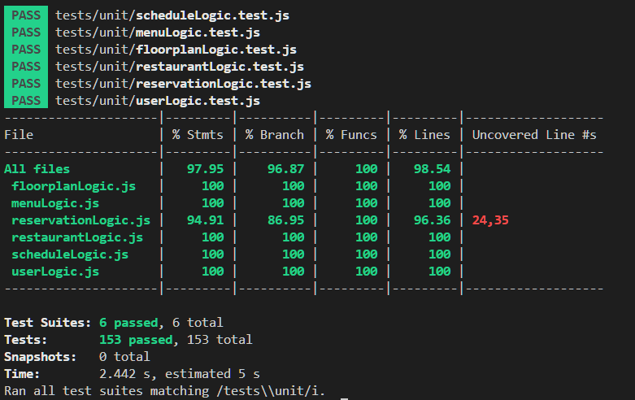
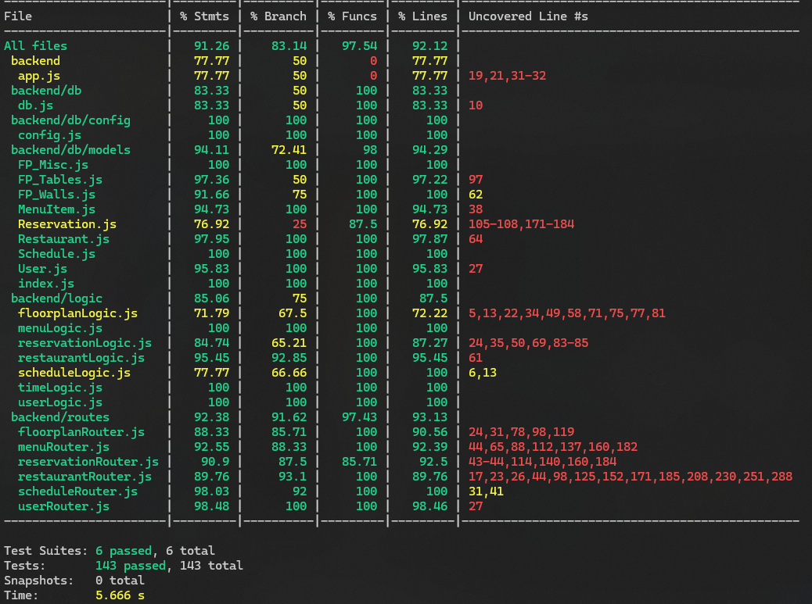

# Group 5 Testing Plan

## Testing Goals and Scope  
Explain *what parts of the system* will be tested (backend, frontend, API, etc.) and *why*—clarify the purpose and extent of your testing.

Our testing scope includes:
- Account Creation and Management (backend, API)
- Restaurant List/Detail (backend, API)
- Menu (backend, API)
- Viewing and Editing Reservations (backend, API)
- Creating a Restaurant Floor Plan (backend, API)

The logic and API of all features implemented in this project are tested. This is reflected by the unit tests covering validation of parameters of all the tests and integration tests, which test connections between the API, logic, and database related to the feature.

Currently the front end requires manual testing, as we encountered an issue with integration tests which must be resolved before creating automatic full system tests.

---

## Testing Frameworks and Tools  
List the frameworks (e.g., Jest, Pytest, Cypress) and tools used for running tests, measuring coverage, or mocking data, and explain *why they were chosen*.

Jest
- Run unit and integration tests for backend
- Measure coverage
- Tests individual simple components in the frontend

- Jest was chosen as it is a popular testing framework. Jest performs tests for the frontend and backend. This was chosen as it made it faster to implement frontend testing since the framework is already being used.

Supertest
- API library for testing for HTTP calls on our API’s endpoints during integration testing

- We chose Supertester because it offers a clean and simple way of making HTTP calls to our endpoints for testing purposes without the need to start up our API server.

[Super Linter](https://github.com/super-linter/super-linter )
- Ensure compliance with standards
- Forces developers to maintain clean code (eg. unused variables )
- We chose superlinter because of its ability to lint many different languages. While we haven’t configured it completely to our need (eg. enforce group coding standards), we think this will be a great all in one solution once we set everything up. 

Jest DOM
- Subcomponent of Jest to test DOM element behaviour

- We chose this because it is already included with Jest. It allowed us to check if our HTML components performed as expected.

---

## Test Organization and Structure  
Describe how your tests are arranged in folders or files (e.g., `tests/unit`, `tests/integration`), and how naming conventions help identify test purpose.

Our tests are arranged in folders to indicate what type of testing the file does. Inside each file, each test has a description/name of what function is being tested and what input is being passed. If it is a valid case, the description of the test is what inputs are being passed and if they are valid, for unit tests they may also include how the inputs are valid. If the test is an edge case, the test describes what input may cause the edge case.

---

## Coverage Targets  
Specify measurable goals (e.g., 100% API method coverage, ≥80% logic class coverage) and link them to your grading or sprint requirements.

The minimum for our measurable goals is ≥ 90% API method coverage, ≥ 80% logic class coverage, and ≥ 90% integration class coverage for Sprint 1. This is to ensure that we are on track to what we need to achieve, but also let us know there is still a lot more work to be done. The actual goal is to reach 100% API method coverage, ≥ 80% logic class coverage, and 100% integration class coverage, as this lets us know we have a good test coverage of our files.

---

## Running Tests  
Include exact commands or scripts for running each type of test and generating coverage reports, so others can easily reproduce your results.  

Instructions on how to run our project locally, including running unit and integration tests can be found [here](https://github.com/BradyS0/TableTrack/blob/main/source/backend/README.md#tests).

Instructions for running frontend tests can be found [here](https://github.com/BradyS0/TableTrack/blob/main/source/frontend/web/README.md).

---

## Reporting and Results  
Explain where to find test reports (HTML, console, CI output) and how to interpret them.  
Include screenshots or links if applicable (e.g., `/coverage/index.html`).

Running the unit tests will create a coverage report in the console as well as the fancy html from jest where you can see in the logic file what is not being run. This can be found at source/backend/coverage/Icov-report/index.html after unit tests have run.

When running the integration tests, a coverage report will be found in the console or in GitHub actions when a pull request is made, where you can find the coverage of the API tests.

---

## Test Data and Environment Setup  
Describe how to prepare the local environment for testing (e.g., database seeding, environment variables, Docker setup).  
Mention any special configuration files required.

Instructions for preparing the local environment for backend testing can be found [here](https://github.com/BradyS0/TableTrack/blob/main/source/backend/README.md).

Instructions for preparing the local environment for frontend testing can be found [here](https://github.com/BradyS0/TableTrack/blob/main/source/frontend/web/README.md).

---

## Quality Assurance and Exceptions  
Identify any untested components, justify why they’re excluded, and explain how you maintain overall quality (e.g., through manual tests or code reviews).

Most of frontend is untested apart from reusable logic. Due to time constraints, we were unable to focus on frontend testing. In the backend, there is no testing for time, since the implementation of time was dependent on the actual day, making it difficult to test specific times. We were not able to test concurrency for reservations.

To maintain overall quality, we use linting to find mistakes such as unused variables as well as code reviews to catch any bugs and improve quality.
---

## Continuous Integration
Note if your tests run automatically in a CI pipeline (GitHub Actions, GitLab CI, etc.) and how that helps maintain consistency.
GitHub Actions - linting, unit tests, integration tests, regression testing
Help contain consistency, as the testing environment remains the same and we know all our code we pull will be working.

We also used a docker container to make our local build consistent no matter what system it runs on.
